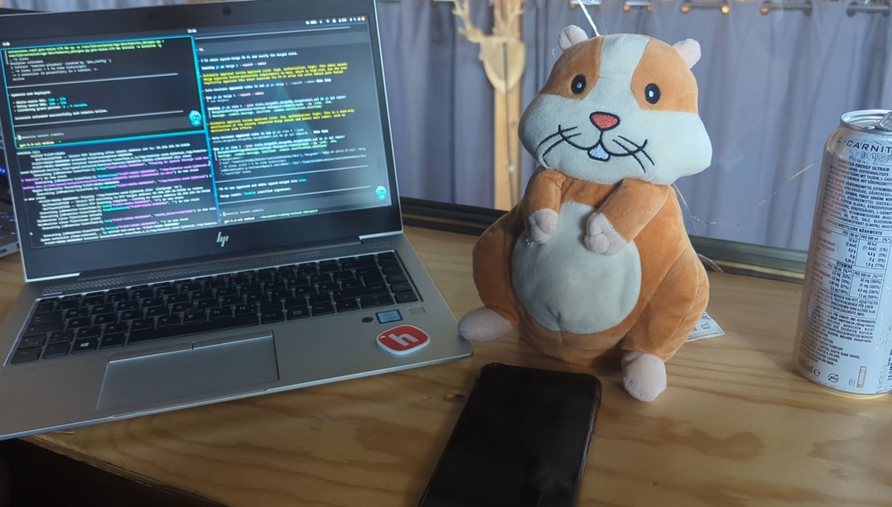
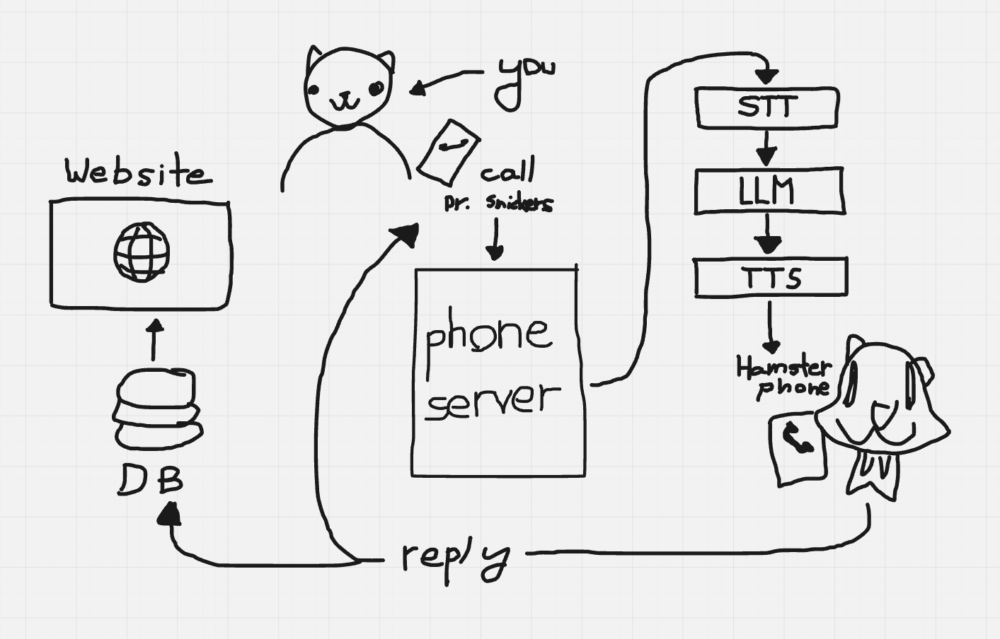

# Dr. Snickers

**The ✨AI-powered✨ hamster therapist**

## About

Dr. Snickers is your **✨AI✨** therapist. Enjoy emotional validation—and subtle roasting—from your favorite hamster!

Dr. Snickers is **SOTA**—in every therapy benchmark. Honestly? This not just another therapist—this will put you—ahead of everyone else—in 2026!

Every answer is personalized—through a SOTA **memory system**. It is fully ***agentic***—and it uses advanced ***prompt engineering***.

Just—call the phone number. And Dr. Snickers will be happy—to help!

## Main features

- Have Dr. Snickers himself roast you directly from your phone
- Enjoy a personalized roasting session through our memory system
- See your conversation history and memory through out website dashboard

## Try it now

**Call +49 221 59619 6054**

**See the dashboard at TODO**

## How it works

1. You call Dr. Snickers from your phone
2. The phone server transcribes your voice and uses ✨AI✨ to make a response and develop a memory of you
3. The response is played on Dr. Snickers' phone
4. Dr. Snickers repeats the response and sends it back to the user's phone
5. The interaction is saved to a database you can then check through a web dashboard

## Tech stack

- **Asterisk** for the phone server
- **Python** for the AI scripts
- **hackai** for the AI APIs
- **Postgres** for the database
- **React / Next.js** for the website

## Host it yourself

### Models and audio assets

- Faster-Whisper environment: `/opt/asterisk-whisper/`
- Whisper Tiny model directory: `/opt/asterisk-whisper/models/`
- Piper executable and libraries
- `en_US-lessac-medium.onnx`
- `en_US-lessac-medium.onnx.json`
- Asterisk sound `hamster-thinking` in `/var/lib/asterisk/sounds/`

The runtime directory is `/var/spool/asterisk/monitor/hamster/`. It must be
writable by Asterisk. Recordings and `__pycache__` files are generated and do
not need copying.

Run `sudo ./deploy-asterisk.sh` to install Piper and Faster-Whisper, then
symlink the Asterisk configuration, AGI scripts, and AI server runtime into
their system directories.

---

Made with :3 for Horizons Europa thanks to Hack Club
